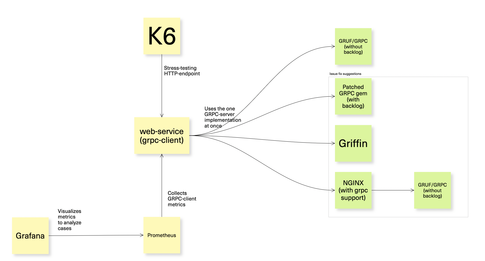
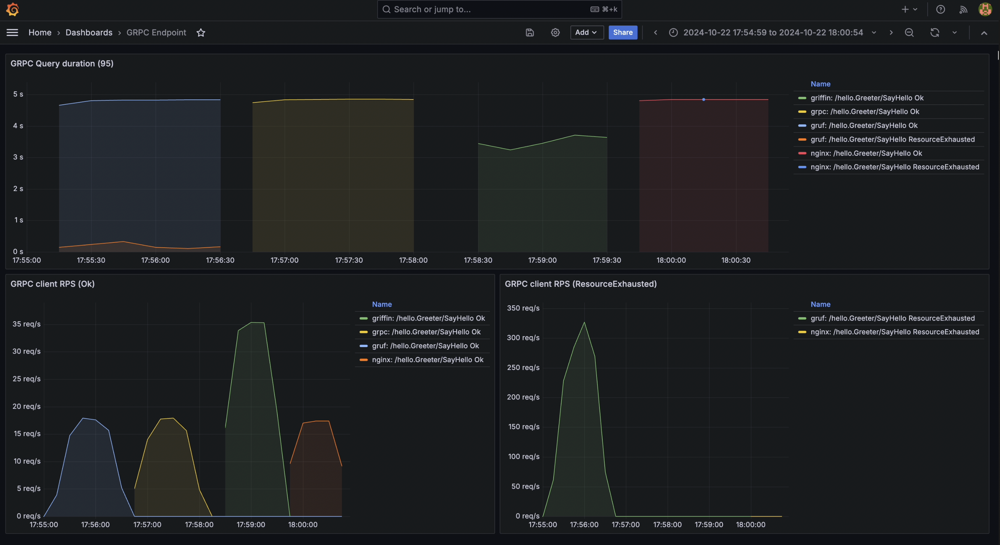

# Research of Ruby GRPC-implementations

We have been using GRUF framework to run GRPC-server in Ruby. But we faced a lack of query-backlog.
When GRPC-server is overloaded and has no capacity to process request right now, it rejects a request end return ResourseExhausted error.

Here is a research on how to fix it. There are several ways:
 - use revese-proxy with query-backlog to park requests until they could be processed
 - move back query-backlog to ruby-grpc library (by reverting very old [PR](https://github.com/grpc/grpc/pull/8632))
 - migrate to [griffin](https://github.com/cookpad/griffin) framework as alternative with support of backlog and multiprocessing


# How it works



# How to run stress-tests

## Provisioning

Install all the dependencies and run all components:
 - client - Rack-based HTTP-server serving `/hello/gprc`, `/hello/gruf`, `/hello/nginx` and `/hello/griffin` endpoints. Makes GRPC-request to hello-world implementation of GRPC-servers
 - prometheus - a Prometheus instance configured to collect metrics from client
 - grafana - a Grafana UI for visualize metrics, http://localhost:3000
 - gruf - basic implementation based on GRUF framework
 - grpc - grpc-ruby gem based implementation with moved back request backlog patch
 - griffin - GRPC-server based on griffin gem
 - nginx - NGINX GRPC reverse proxy with support of query backlog

To setup environment run:

```
# provision
dip provision

# get services up and running
dip compose up client grafana prometheus gruf griffin nginx grpc
```

## Check everything is ok

```
# check all GRPC-servers are up and running
dip grpcurl gruf
dip grpcurl griffin
dip grpcurl nginx
dip grpcurl grpc

# check if http server started and is ready to use underlying GRPC
dip compose exec client curl http://localhost:9292/hello/gruf
dip compose exec client curl http://localhost:9292/hello/griffin
dip compose exec client curl http://localhost:9292/hello/grpc
dip compose exec client curl http://localhost:9292/hello/nginx

# check if metrics port is exposed
dip compose exec client curl http://localhost:9394/metrics
```

## Runs stress-tests

```
# runs k6 stress test for any GRPC-implementation
dip k6 gruf_http
dip k6 griffin_http
dip k6 grpc_http
dip k6 nginx_http
```

## Results

Navigate to http://localhost:3000/ admin/password to the "GRPC endpoint" dashboard

